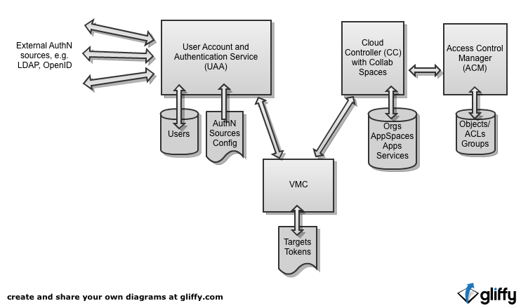
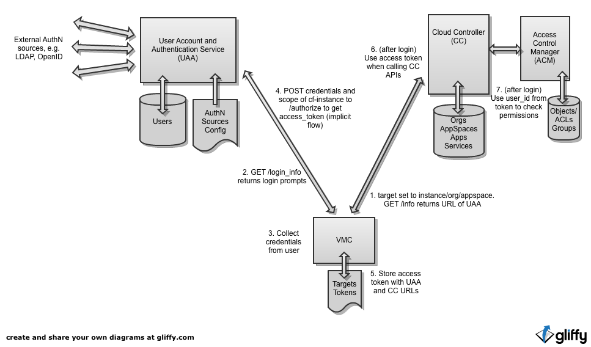
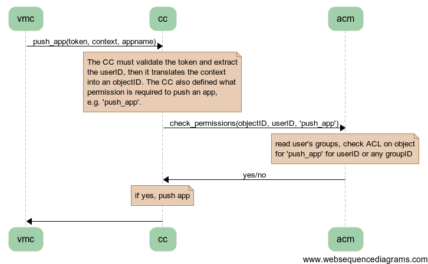
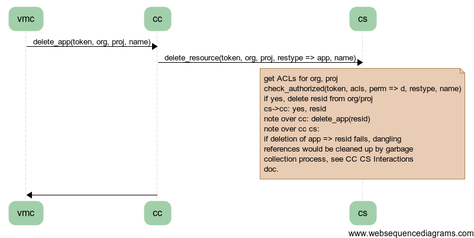
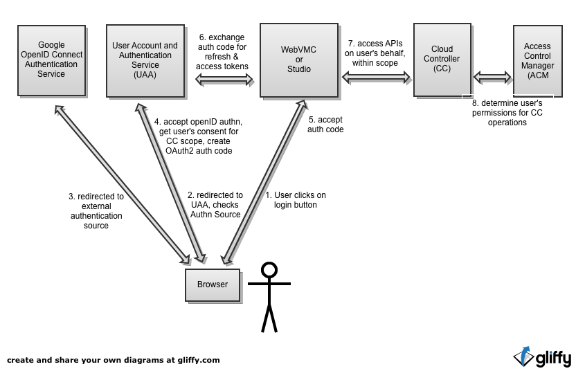
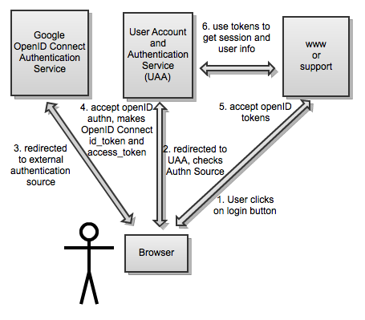

==============================================
Interactions Between the UAA, CC, ACM and VMC
==============================================

.. contents:: Table of Contents

Introduction
=============

This document describes interactions between 4 components:

UAA - The `User Account and Authentication Service`_
    A new, separate process accessible via HTTP endpoints.

ACM - The `Access Control Manager`_
    An initial collaboration spaces module to be included in the cloud controller.

CC - The `Cloud Controller and Collaboration Spaces`_
    What changes would be required to the existing code.

VMC - The `VMC Command Line`_ tool
    What changes would be required to existing code.

After discussing each component we walk through a series of `vmc flows`_ of what happens for a specific set of operations. 

Lastly we will illustrate `web application flows`_.

The relationships between these components can be illustrated like this:

User Account and Authentication Service
========================================

Overview
--------------

The User Account and Authentication Service (UAA) is:

* A new, separate application from the Cloud Controller
* Owns the user accounts and authentication sources
* Called via REST APIs
* Support for standard protocols to provide single sign-on and delegated 
  authorization to web applications in addition to REST APIs to support 
  the Cloud Controller and Collaboration Spaces

For more information see the `UAA detailed API documentation <UAA-APIs>`_

UAA and OAuth2 Scopes
----------------------

OAuth2 specifies that access tokens can bound to a set of strings called "scopes" -- the exact content and meaning
of the scope is left to the UAA and any servers that will control access to resources. In some uses the scope is
simply the URL of the resource server. Resource servers should only grant access that is with a scope that has been 
authorized by the user -- which may be a more narrow scope than what the client application requested. 

Initially we will use the scope parameter of OAuth to scope an access_token to a specific cloud foundry instance. The 
UAA and all associated resource servers, e.g. cloud controller, need to agree on scope meanings. In our case, this 
means that a resource server should check that the scope is their own URL. They should not honor access tokens for other scopes. 

Access Control Manager
==================================

The Access Control Manager (ACM) `source code repository`__ contains a `detailed API document`__.

__ https://github.com/cloudfoundry/acm
__ https://github.com/cloudfoundry/acm/blob/master/docs/Access-Control-Manager-APIs.rst

Overview
----------

The ACM:

* contains a series of permission sets as defined by the ACM client.
* contains a set of objects with access control lists (ACL). Entries in each ACL control when a user has a permission within a set that is allowed on that object.
* contains a set of objects which represent groups. Access to the group and roup membership are controlled by the ACL in an associated object.
* handles access control calculations for client services by calculating what permissions users have to specific objects.

  - In the case of the cloud controller, objects may represent orgs or app spaces. However, the design
    is intended to be as general as possible so that it an be used in other cloud foundry components
    as well.

* Configuration options

  - Shared secret used for authentication by the client service.
  - Database configuration

Features
----------

Cloud foundry services want the ability to perform the following types of operations to enable
collaboration spaces.

* Control access to organizational objects such as Org, Groups, and App Spaces
* Create and manage groups of users that can be used to manage access to Orgs and App Spaces
* Assign permissions to organizational objects for specific users or groups.
* Control what permissions are allowed and calculated for specific object ACLs.

Cloud Controller and Collaboration Spaces
================================================

General Changes
-----------------------------------------

* Recognition that the user is operating in the context of a particular org and app space.

    Each operation needs to recognize its org and project and operate in that context. 

Database Changes
-----------------------------------------

* User accounts => orgs, add app spaces

    Orgs will replace users as the owners of apps and services. Therefore the apps and services that
    are currently linked to users will now be linked to orgs. The schema will need to be updated for
    this.
    
* New operation support

    Cloud controller will need to support an info call per org that can return the URL of the UAA for that org.

* User account updates
    
    The ACM will only operate in terms of unique identifiers for users retrieved from the UAA.
    
* Org and App Space object management within the ACM
    
    The cloud controller will need to create permission sets for objects it wants to control access via the ACM. Then, for
    each object such as an Org or App Space, it needs to create an object and record its ID in the CC database.

Code changes
-----------------------------------------

* Authorize an operation

    The cloud controller will need to make calls to the ACM to authorize each operation.

* Add authorization filters

* operate on object IDs based received from the ACM, and user ID received from token in the UAA. 
      
New API endpoints of UAA and ACM
----------------------------------------------------------

* Create User, etc.
* Manage ACLs and groups

Resource Garbage Collection
-----------------------------------------

There are failure cases where resources can get out of sync between the CC and ACM. Need a periodic sync process to clean up dangling references. 

VMC Command Line
=====================================

* Add orgs and appspaces to existing target contexts. vmc may need new options to simplify user's understanding of orgs and appspaces instead of just appending them to the URL of the cloud foundry instance.

* Get UAA endpoint and process dynamic login info. vmc needs to be able to get the URL of the UAA for the target org and then request the login info from that UAA. It then needs to handle different prompt types to collect the users credentials and then request a token from the UAA. 

* Each token needs to be stored with it's UAA and CFInstance URLs. When changing context to another org or project that uses the same UAA and CFInstance URLs, the user does not need to log in again but can continue to use the same token.

* vmc would also need to communicate the org and appspace to the user in an info call as well as in the call to push so that the user is aware of the context that is being pushed to.

A POC implementation of some of these changes, especially the interactions with the UAA and the dynamic login info is available here: https://github.com/daleolds/vmc .

VMC Flows
==================================

Login flow for vmc to UAA, cloud controller and ACM:

Web sequence diagrams for various operations

1. vmc login

.. image:: diagrams/flow-login.png
   :alt: vmc login
   :target: diagrams/flow-login.txt

2. vmc push app

3. vmc delete app

#. `vmc login <diagrams/flow-login.png>`_ -- (`text <diagrams/flow-login.txt>`__)
#. `vmc push app <diagrams/flow-push-app.png>`_ -- (`text <diagrams/flow-push-app.txt>`__)
#. `vmc delete app <diagrams/flow-delete-app.png>`_ -- (`text <diagrams/flow-delete-app.txt>`__)
#. `vmc create org <diagrams/flow-create-org.png>`_ -- (`text <diagrams/flow-create-org.txt>`__)
#. `vmc add permissions <diagrams/flow-add-permissions.png>`_ -- (`text <diagrams/flow-add-permissions.txt>`__)
#. `vmc bind service <diagrams/flow-bind-service.png>`_ -- (`text <diagrams/flow-bind-service.txt>`__)

Web Application Flows
======================================

Delegated Access to Cloud Controller APIs
-----------------------------------------

SSO to CloudFoundry Support Apps
-----------------------------------------

Open Issues
========================================

* New LDAP user -- expect UAA to be able to provide Just In Time provisioning, i.e. create an account as the user authenticates.
* Design database user account migration
* we have now allowed for multiple UAAs per CC, but we should also support multiple CC per UAA -- and should get single signon between them. Really need a refresh token. Need to consider OAuth2 authcode flow vs. implicit flow (as Dave has suggested). 

